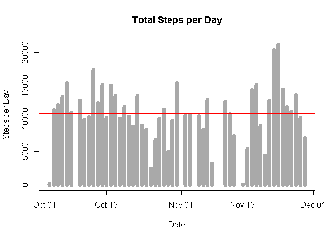
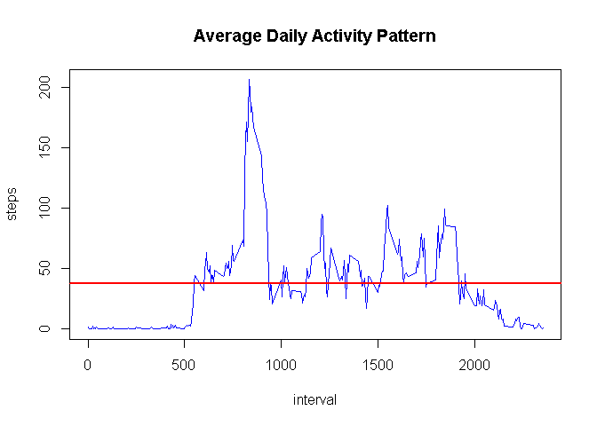
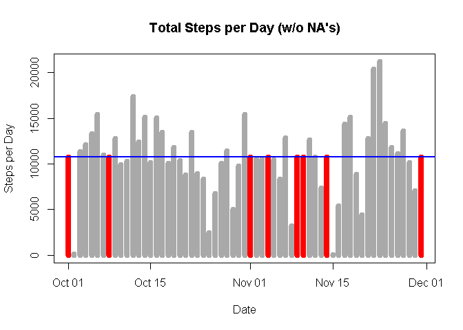
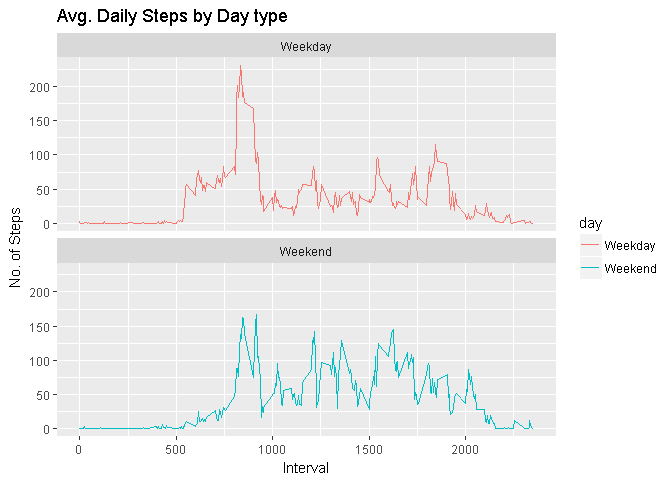

# RR Course Project 1
Adarsh Halan  
23 May 2017  


# Peer-graded Assignment: Course Project 1

## Introduction

It is now possible to collect a large amount of data about personal movement using activity monitoring devices such as a Fitbit, Nike Fuelband, or Jawbone Up. These type of devices are part of the "quantified self" movement - a group of enthusiasts who take measurements about themselves regularly to improve their health, to find patterns in their behavior, or because they are tech geeks. But these data remain under-utilized both because the raw data are hard to obtain and there is a lack of statistical methods and software for processing and interpreting the data.

This assignment makes use of data from a personal activity monitoring device. This device collects data at 5 minute intervals through out the day. The data consists of two months of data from an anonymous individual collected during the months of October and November, 2012 and include the number of steps taken in 5 minute intervals each day.

The data for this assignment can be downloaded from the course web site:

Dataset: Activity monitoring data [52K]
(https://d396qusza40orc.cloudfront.net/repdata%2Fdata%2Factivity.zip)

The variables included in this dataset are:

steps: Number of steps taking in a 5-minute interval (missing values are coded as NA)
date: The date on which the measurement was taken in YYYY-MM-DD format
interval: Identifier for the 5-minute interval in which measurement was taken
The dataset is stored in a comma-separated-value (CSV) file and there are a total of 17,568 observations in this dataset.


## R preparations

In this document code will be represented to show how the results have been achieved. Set the default of echo to be true throughout the document:

```r
library(knitr)
opts_chunk$set(echo = TRUE)
```

## set working directory to the folder containing the raw data
## setwd("~/activity data")
## Load in the necessary packages


```r
library(data.table)
library(dplyr)
```

```
## -------------------------------------------------------------------------
```

```
## data.table + dplyr code now lives in dtplyr.
## Please library(dtplyr)!
```

```
## -------------------------------------------------------------------------
```

```
## 
## Attaching package: 'dplyr'
```

```
## The following objects are masked from 'package:data.table':
## 
##     between, first, last
```

```
## The following objects are masked from 'package:stats':
## 
##     filter, lag
```

```
## The following objects are masked from 'package:base':
## 
##     intersect, setdiff, setequal, union
```

```r
library(ggplot2)
```

## Read and Load data

The data is loaded using the read.csv().

NOTE: It is assumed that you have already downloaded the activity.csv and saved it in your working directory


```r
data <- read.csv("activity.csv", header=TRUE, sep=",")
```

## Tidying the data
Change the date into dateformat using lubridate:


```r
data$date <- as.Date(data$date)
```

Check the data with str() and head():


```r
str(data)
```

```
## 'data.frame':	17568 obs. of  3 variables:
##  $ steps   : int  NA NA NA NA NA NA NA NA NA NA ...
##  $ date    : Date, format: "2012-10-01" "2012-10-01" ...
##  $ interval: int  0 5 10 15 20 25 30 35 40 45 ...
```

```r
head(data)
```

```
##   steps       date interval
## 1    NA 2012-10-01        0
## 2    NA 2012-10-01        5
## 3    NA 2012-10-01       10
## 4    NA 2012-10-01       15
## 5    NA 2012-10-01       20
## 6    NA 2012-10-01       25
```

Now we are ready and set up for solving the asked questions.

# Q1 What is mean total number of steps taken per day?

## Methodology and Result

1.  Calculate the total number of steps per day using aggregate (ignoring NA values):


```r
steps <- aggregate(steps~date, data, sum, na.rm = TRUE)
str(steps)
```

```
## 'data.frame':	53 obs. of  2 variables:
##  $ date : Date, format: "2012-10-02" "2012-10-03" ...
##  $ steps: int  126 11352 12116 13294 15420 11015 12811 9900 10304 17382 ...
```

2.  Plot Graph of the above data:


```r
p <- plot(steps$date, steps$steps, type = "h", lwd = 8, 
          xlab = "Date", ylab = "Steps per Day", col = "darkgray", 
          main = "Total Steps per Day") + abline(h = median(steps$steps, na.rm = TRUE), col="red", lwd=2)
```

<!-- -->

3.  Calculate the mean and median of the total number of steps taken per day:


```r
meansteps <- mean(steps$steps,na.rm = TRUE)
mediansteps <- median(steps$steps, na.rm = TRUE)
```

4. Print Mean and Median calculated above


```r
paste("Mean Steps = ", meansteps)
```

```
## [1] "Mean Steps =  10766.1886792453"
```

```r
paste("Median Steps =", mediansteps)
```

```
## [1] "Median Steps = 10765"
```

# Q2: What is the average daily activity pattern?

## Methodology and Result

1. Calculate the mean number of steps per interval using aggregate (ignoring NA values):


```r
steps1 <- aggregate(steps~interval, data, mean, na.rm = TRUE) 
```

2. Plot graph of above data i.e steps vs interval (time-series)


```r
q <- plot(steps~interval, data = steps1, col="blue", type = "l", 
          main = "Average Daily Activity Pattern")
abline(h=mean(steps1$steps, na.rm=TRUE), col="red", lwd=2)
```

<!-- -->

3. Use which.max() to find out the maximum steps, on average, across all the days:


```r
maxinterval <- steps1[which.max(steps1$steps),]
```

## Answer:

```r
paste("5-Minute interval with Max no of Steps = ", maxinterval$interval, 
      "with no of steps = ", round(maxinterval$steps))
```

```
## [1] "5-Minute interval with Max no of Steps =  835 with no of steps =  206"
```

# Imputing missing values

Note that there are a number of days/intervals where there are missing values (coded as NA). The presence of missing days may introduce bias into some calculations or summaries of the data.

## 1. Calculate and report the total number of missing values in the dataset (i.e. the total number of rows with NAs)

## Methodology and Result

a) Summarise missing values:


```r
stepsna <- sum(is.na(data$steps))
paste("No of missing values in Steps =", stepsna)
```

```
## [1] "No of missing values in Steps = 2304"
```

b) We are using the mean of the 5-minute interval to fill in the missing values in the above data

For this 1st we make a copy of the original data to data2 and use tapply to fill in the missing values with the avg number of steps per 5-minute interval


```r
data2 <- data
nadata <- is.na(data2$steps)
avg_interval <- tapply(data2$steps, data2$interval, mean, na.rm=TRUE, simplify = TRUE)
data2$steps[nadata] <- avg_interval[as.character(data2$interval[nadata])]
names(data2)
```

```
## [1] "steps"    "date"     "interval"
```

check for no NA


```r
sum(is.na(data2))
```

```
## [1] 0
```

No more missing data

Calculate the number of steps taken in each 5-minute interval per day using dplyr and group by interval. :


```r
stepsdata2 <- group_by(data2, date) %>% summarise(sum_steps = sum(steps),
              mean_steps = mean(steps), median_steps = median(steps))
```


Use plot for making the histogram


```r
q1 <- plot(stepsdata2$date, stepsdata2$sum_steps, type = "h", lwd = 8, 
           xlab = "Date", ylab = "Steps per Day", col = ifelse(stepsdata2$median_steps>0,'red','darkgrey'), 
           main = "Total Steps per Day (w/o NA's)") + 
        abline(h = mean(stepsdata2$sum_steps, na.rm = TRUE), col="blue", lwd=2)
```

<!-- -->

Blue Line shows the mead of the above distribution
The red bars show the missing data filled 

Calculate the mean and median steps with the filled in values:


```r
meansteps2 <- mean(data2$steps,na.rm = TRUE)
mediansteps2 <- median(data2$steps, na.rm = TRUE)
```

##  Calculate and report the mean and median total number of steps taken per day


```r
paste("Mean Steps = ", meansteps2)
```

```
## [1] "Mean Steps =  37.3825995807128"
```

```r
paste("Median Steps =", mediansteps2)
```

```
## [1] "Median Steps = 0"
```

## 2. Do these values differ from the estimates from the first part of the assignment? What is the impact of imputing missing data on the estimates of the total daily number of steps?


```r
stepsdata1 <- group_by(data, date) %>% summarise(sum_steps = sum(steps),
                                                  mean_steps = mean(steps), median_steps = median(steps))

summary(stepsdata1)
```

```
##       date              sum_steps       mean_steps       median_steps
##  Min.   :2012-10-01   Min.   :   41   Min.   : 0.1424   Min.   :0    
##  1st Qu.:2012-10-16   1st Qu.: 8841   1st Qu.:30.6979   1st Qu.:0    
##  Median :2012-10-31   Median :10765   Median :37.3785   Median :0    
##  Mean   :2012-10-31   Mean   :10766   Mean   :37.3826   Mean   :0    
##  3rd Qu.:2012-11-15   3rd Qu.:13294   3rd Qu.:46.1597   3rd Qu.:0    
##  Max.   :2012-11-30   Max.   :21194   Max.   :73.5903   Max.   :0    
##                       NA's   :8       NA's   :8         NA's   :8
```

```r
summary(stepsdata2)
```

```
##       date              sum_steps       mean_steps       median_steps   
##  Min.   :2012-10-01   Min.   :   41   Min.   : 0.1424   Min.   : 0.000  
##  1st Qu.:2012-10-16   1st Qu.: 9819   1st Qu.:34.0938   1st Qu.: 0.000  
##  Median :2012-10-31   Median :10766   Median :37.3826   Median : 0.000  
##  Mean   :2012-10-31   Mean   :10766   Mean   :37.3826   Mean   : 4.474  
##  3rd Qu.:2012-11-15   3rd Qu.:12811   3rd Qu.:44.4826   3rd Qu.: 0.000  
##  Max.   :2012-11-30   Max.   :21194   Max.   :73.5903   Max.   :34.113
```

## Answer

As we can see above Mean and median values are almost identical, but the quantiles are significantly different.

## 3. Are there differences in activity patterns between weekdays and weekends?

## Methodology and Result

Use dplyr and mutate to create a new column, day, and apply whether the day is weekend or weekday:


```r
data3 <- data2 %>% 
    mutate(day= ifelse(weekdays(data2$date)=="Saturday" | weekdays(data2$date)=="Sunday", "Weekend", "Weekday"))

data3$day <- as.factor(data3$day)

head(data3)
```

```
##       steps       date interval     day
## 1 1.7169811 2012-10-01        0 Weekday
## 2 0.3396226 2012-10-01        5 Weekday
## 3 0.1320755 2012-10-01       10 Weekday
## 4 0.1509434 2012-10-01       15 Weekday
## 5 0.0754717 2012-10-01       20 Weekday
## 6 2.0943396 2012-10-01       25 Weekday
```


Calculate the average steps in the 5-minute interval and use ggplot for making the time series of the 5-minute interval for weekday and weekend, and compare the average steps:


```r
plotdata <- data3 %>% group_by(interval, day) %>% 
    summarise(steps = mean(steps))

s <- ggplot(plotdata, aes(x=interval, y=steps, color = day)) +
    geom_line() + facet_wrap(~day, ncol = 1, nrow=2) + 
    labs(title = "Avg. Daily Steps by Day type", x = "Interval", y = "No. of Steps") 

print(s)
```

<!-- -->


## Answer:

During the weekday, the test object is more active earlier in the day but the object is more active throughout the weekends probably because the oject is  working during the weekdays, hence moving less during the day.

